# SBD1 — Proyecto 2: Centros de Evaluación de Manejo

API REST para la gestión de Centros de Evaluación de Manejo de Guatemala, desarrollada con Node.js, Express y Oracle Database XE.

**Universidad San Carlos de Guatemala — Facultad de Ingeniería — ECYS**

## Stack Tecnológico

| Componente | Tecnología |
|---|---|
| Base de datos | Oracle Database XE 21c (Docker) |
| Backend | Node.js + Express |
| Cliente BD | DBeaver |
| Pruebas | cURL (script automatizado) |

## Estructura del Proyecto

```
SBD1B_1S2026_202300625/
├── docker-compose.yml          # Orquestación de servicios
├── db/
│   └── init.sql                # DDL + datos semilla
├── api/
│   ├── Dockerfile              # Imagen del backend
│   ├── index.js                # Entry point Express
│   ├── db.js                   # Conexión a Oracle
│   ├── routes/                 # Rutas CRUD por tabla
│   └── controllers/            # Lógica de negocio
├── postman/
│   └── coleccion.json          # Colección Postman (referencia)
├── curl_documentation.sh       # Script de pruebas con cURL
└── README.md
```

## Requisitos Previos

- [Docker](https://docs.docker.com/get-docker/) y Docker Compose instalados
- [DBeaver](https://dbeaver.io/) (opcional, para validar la BD)

## Guía de Instalación

### 1. Clonar el repositorio

```bash
git clone <url-del-repositorio>
cd SBD1B_1S2026_202300625
```

### 2. Configurar variables de entorno

Crear el archivo `.env` en la raíz del proyecto:

```env
# Oracle
ORACLE_PASSWORD=YourStrongPassword1
DB_USER=system
DB_PASSWORD=YourStrongPassword1
ORACLE_PORT=1521
DB_SERVICE=XE

# API
API_PORT=3000
```

> **Importante:** Cambiar `YourStrongPassword1` por una contraseña segura.

### 3. Levantar los servicios con Docker Compose

```bash
docker-compose up -d
```

Esto iniciará dos contenedores:
- **oracle-xe**: Oracle Database XE 21c en el puerto `1521`
- **sbd1-api**: API REST en el puerto `3000`

> **Nota:** La primera ejecución puede tardar varios minutos mientras Oracle se inicializa y ejecuta el script DDL automáticamente.

### 4. Verificar el estado

```bash
docker-compose ps
```

Ambos servicios deben mostrar estado `healthy` o `Up`.

```bash
# Verificar logs de la API
docker-compose logs api
```

```
 Conexión exitosa a Oracle XE
 API corriendo en http://localhost:3000
```

### 5. Probar la API

```bash
curl http://localhost:3000/health
```

Respuesta esperada:
```json
{
  "status": "OK",
  "database": "Oracle XE",
  "timestamp": "2026-04-25T..."
}
```

## Conexión desde DBeaver

1. Nueva conexión → **Oracle**
2. Configurar los siguientes parámetros:

| Campo | Valor |
|---|---|
| Host | `localhost` |
| Port | `1521` |
| Database / Service | `XE` |
| Username | `system` |
| Password | La definida en `.env` (`ORACLE_PASSWORD`) |

3. Hacer clic en **Test Connection** y luego **Finish**

Las tablas deben aparecer en el esquema `SYSTEM`:
- `LICENCIA`, `DEPARTAMENTO`, `MUNICIPIO`, `CENTRO_EVAL`, `ESCUELA_AUTOMOV`
- `UBICACION`, `REGISTRO`, `CORRELATIVO`, `EXAMEN`
- `PREGUNTA`, `PREGUNTA_PRACTICO`, `RESPUESTA_USUARIO`, `RESPUESTA_PRACTICO_USUARIO`

## Endpoints de la API

### Health Check

| Método | Ruta | Descripción |
|---|---|---|
| GET | `/health` | Estado de la API |

### CRUD (13 tablas)

Cada tabla tiene endpoints listar, obtener, crear, actualizar y eliminar:

| Método | Ruta | Acción |
|---|---|---|
| GET | `/api/<tabla>` | Listar todos |
| GET | `/api/<tabla>/:id` | Obtener por ID |
| POST | `/api/<tabla>` | Crear registro |
| PUT | `/api/<tabla>/:id` | Actualizar registro |
| DELETE | `/api/<tabla>/:id` | Eliminar registro |

**Tablas disponibles:**

| Ruta | Tabla |
|---|---|
| `/api/centros` | CENTRO_EVAL |
| `/api/escuelas` | ESCUELA_AUTOMOV |
| `/api/licencias` | LICENCIA |
| `/api/departamentos` | DEPARTAMENTO |
| `/api/municipios` | MUNICIPIO |
| `/api/ubicaciones` | UBICACION |
| `/api/registros` | REGISTRO |
| `/api/correlativos` | CORRELATIVO |
| `/api/examenes` | EXAMEN |
| `/api/preguntas` | PREGUNTA |
| `/api/preguntas-practico` | PREGUNTA_PRACTICO |
| `/api/respuestas-usuario` | RESPUESTA_USUARIO |
| `/api/respuestas-practico` | RESPUESTA_PRACTICO_USUARIO |

### Consultas Estadísticas

| Método | Ruta | Descripción |
|---|---|---|
| GET | `/api/estadisticas/consulta1` | Estadísticas de evaluaciones por centro y escuela |
| GET | `/api/estadisticas/consulta2` | Ranking de evaluados por resultado final |
| GET | `/api/estadisticas/consulta3` | Pregunta(s) del examen teórico con menor porcentaje de aciertos |

## Pruebas con cURL

El proyecto incluye un script automatizado `curl_documentation.sh` que ejecuta pruebas sobre **todos los endpoints** de la API, incluyendo casos de error.

### Ejecutar el script completo

```bash
# Dar permisos de ejecución (si no se hizo antes)
chmod +x curl_documentation.sh

# Ejecutar todas las pruebas
./curl_documentation.sh
```

El script ejecuta automáticamente más de **70 peticiones** organizadas en 16 secciones:

| Sección | Endpoints | Descripción |
|---|---|---|
| 1 | `GET /health` | Health check |
| 2-14 | CRUD (13 tablas) | GET, POST, PUT, DELETE por tabla |
| 15 | Consultas estadísticas | 3 endpoints especiales |
| 16 | Pruebas de error | HTTP 400, 404 |

### Comandos curl por sección

#### Health Check
```bash
curl -s http://localhost:3000/health | python3 -m json.tool
```

#### Centros de Evaluación
```bash
# Listar todos
curl -s http://localhost:3000/api/centros | python3 -m json.tool

# Obtener por ID
curl -s http://localhost:3000/api/centros/1 | python3 -m json.tool

# Crear
curl -s -X POST http://localhost:3000/api/centros \
  -H "Content-Type: application/json" \
  -d '{"nombre": "Centro de Prueba"}' | python3 -m json.tool

# Actualizar
curl -s -X PUT http://localhost:3000/api/centros/1 \
  -H "Content-Type: application/json" \
  -d '{"nombre": "Centro Actualizado"}' | python3 -m json.tool

# Eliminar
curl -s -X DELETE http://localhost:3000/api/centros/99 | python3 -m json.tool
```

#### Escuelas de Manejo
```bash
curl -s http://localhost:3000/api/escuelas | python3 -m json.tool
curl -s http://localhost:3000/api/escuelas/1 | python3 -m json.tool

curl -s -X POST http://localhost:3000/api/escuelas \
  -H "Content-Type: application/json" \
  -d '{"nombre": "Escuela de Prueba", "direccion": "6a Avenida 1-80 Zona 1", "acuerdo": "Acuerdo 2026-001"}' | python3 -m json.tool

curl -s -X PUT http://localhost:3000/api/escuelas/1 \
  -H "Content-Type: application/json" \
  -d '{"nombre": "Escuela Actualizada", "direccion": "Dirección actualizada", "acuerdo": "Acuerdo 2026-002"}' | python3 -m json.tool

curl -s -X DELETE http://localhost:3000/api/escuelas/99 | python3 -m json.tool
```

#### Licencias
```bash
curl -s http://localhost:3000/api/licencias | python3 -m json.tool
curl -s http://localhost:3000/api/licencias/A | python3 -m json.tool

curl -s -X POST http://localhost:3000/api/licencias \
  -H "Content-Type: application/json" \
  -d '{"codigo": "Z", "descripcion": "Licencia de Prueba"}' | python3 -m json.tool

curl -s -X PUT http://localhost:3000/api/licencias/Z \
  -H "Content-Type: application/json" \
  -d '{"descripcion": "Licencia Actualizada"}' | python3 -m json.tool

curl -s -X DELETE http://localhost:3000/api/licencias/Z | python3 -m json.tool
```

#### Departamentos
```bash
curl -s http://localhost:3000/api/departamentos | python3 -m json.tool
curl -s http://localhost:3000/api/departamentos/1 | python3 -m json.tool

curl -s -X POST http://localhost:3000/api/departamentos \
  -H "Content-Type: application/json" \
  -d '{"nombre": "Depto Prueba", "codigo": "DP"}' | python3 -m json.tool

curl -s -X PUT http://localhost:3000/api/departamentos/1 \
  -H "Content-Type: application/json" \
  -d '{"nombre": "Depto Actualizado", "codigo": "DA"}' | python3 -m json.tool

curl -s -X DELETE http://localhost:3000/api/departamentos/99 | python3 -m json.tool
```

#### Municipios
```bash
curl -s http://localhost:3000/api/municipios | python3 -m json.tool
curl -s http://localhost:3000/api/municipios/1 | python3 -m json.tool

curl -s -X POST http://localhost:3000/api/municipios \
  -H "Content-Type: application/json" \
  -d '{"departamento_id_departamento": 1, "nombre": "Municipio Prueba", "codigo": "MP"}' | python3 -m json.tool

curl -s -X PUT http://localhost:3000/api/municipios/1 \
  -H "Content-Type: application/json" \
  -d '{"departamento_id_departamento": 1, "nombre": "Municipio Actualizado", "codigo": "MA"}' | python3 -m json.tool

curl -s -X DELETE http://localhost:3000/api/municipios/99 | python3 -m json.tool
```

#### Ubicaciones (clave compuesta)
```bash
curl -s http://localhost:3000/api/ubicaciones | python3 -m json.tool
curl -s http://localhost:3000/api/ubicaciones/1/1 | python3 -m json.tool

curl -s -X POST http://localhost:3000/api/ubicaciones \
  -H "Content-Type: application/json" \
  -d '{"escuela_id_escuela": 1, "centro_id_centro": 1}' | python3 -m json.tool

curl -s -X PUT http://localhost:3000/api/ubicaciones/1/1 \
  -H "Content-Type: application/json" \
  -d '{"escuela_id_escuela": 2, "centro_id_centro": 2}' | python3 -m json.tool

curl -s -X DELETE http://localhost:3000/api/ubicaciones/99/99 | python3 -m json.tool
```

#### Registros
```bash
curl -s http://localhost:3000/api/registros | python3 -m json.tool
curl -s http://localhost:3000/api/registros/1 | python3 -m json.tool

curl -s -X POST http://localhost:3000/api/registros \
  -H "Content-Type: application/json" \
  -d '{"ubicacion_escuela_id_escuela": 1, "ubicacion_centro_id_centro": 1, "municipio_id_municipio": 1, "municipio_departamento_id_departamento": 1, "fecha": "2026-04-28", "tipo_tramite": "NUEVA", "tipo_licencia": "A", "nombre_completo": "Juan Pérez", "genero": "M"}' | python3 -m json.tool

curl -s -X PUT http://localhost:3000/api/registros/1 \
  -H "Content-Type: application/json" \
  -d '{"ubicacion_escuela_id_escuela": 1, "ubicacion_centro_id_centro": 1, "municipio_id_municipio": 1, "municipio_departamento_id_departamento": 1, "fecha": "2026-04-28", "tipo_tramite": "RENOVACION", "tipo_licencia": "B", "nombre_completo": "Juan Pérez Actualizado", "genero": "M"}' | python3 -m json.tool

curl -s -X DELETE http://localhost:3000/api/registros/99 | python3 -m json.tool
```

#### Correlativos
```bash
curl -s http://localhost:3000/api/correlativos | python3 -m json.tool
curl -s http://localhost:3000/api/correlativos/1 | python3 -m json.tool

curl -s -X POST http://localhost:3000/api/correlativos \
  -H "Content-Type: application/json" \
  -d '{"fecha": "2026-04-28", "no_examen": 1001}' | python3 -m json.tool

curl -s -X PUT http://localhost:3000/api/correlativos/1 \
  -H "Content-Type: application/json" \
  -d '{"fecha": "2026-04-28", "no_examen": 1002}' | python3 -m json.tool

curl -s -X DELETE http://localhost:3000/api/correlativos/99 | python3 -m json.tool
```

#### Exámenes
```bash
curl -s http://localhost:3000/api/examenes | python3 -m json.tool
curl -s http://localhost:3000/api/examenes/1 | python3 -m json.tool

curl -s -X POST http://localhost:3000/api/examenes \
  -H "Content-Type: application/json" \
  -d '{"registro_id_registro": 1, "correlativo_id_correlativo": 1, "registro_id_escuela": 1, "registro_id_centro": 1, "registro_municipio_id_municipio": 1, "registro_municipio_departamento_id_departamento": 1}' | python3 -m json.tool

curl -s -X PUT http://localhost:3000/api/examenes/1 \
  -H "Content-Type: application/json" \
  -d '{"registro_id_registro": 1, "correlativo_id_correlativo": 2, "registro_id_escuela": 1, "registro_id_centro": 1, "registro_municipio_id_municipio": 1, "registro_municipio_departamento_id_departamento": 1}' | python3 -m json.tool

curl -s -X DELETE http://localhost:3000/api/examenes/99 | python3 -m json.tool
```

#### Preguntas Teóricas
```bash
curl -s http://localhost:3000/api/preguntas | python3 -m json.tool
curl -s http://localhost:3000/api/preguntas/1 | python3 -m json.tool

curl -s -X POST http://localhost:3000/api/preguntas \
  -H "Content-Type: application/json" \
  -d '{"pregunta_texto": "¿Velocidad máxima en zona escolar?", "respuesta_a": "30 km/h", "respuesta_b": "40 km/h", "respuesta_c": "50 km/h", "respuesta_d": "60 km/h", "respuesta_correcta": "A"}' | python3 -m json.tool

curl -s -X PUT http://localhost:3000/api/preguntas/1 \
  -H "Content-Type: application/json" \
  -d '{"pregunta_texto": "¿Velocidad máxima en zona escolar?", "respuesta_a": "30 km/h", "respuesta_b": "40 km/h", "respuesta_c": "50 km/h", "respuesta_d": "60 km/h", "respuesta_correcta": "A"}' | python3 -m json.tool

curl -s -X DELETE http://localhost:3000/api/preguntas/99 | python3 -m json.tool
```

#### Preguntas Prácticas
```bash
curl -s http://localhost:3000/api/preguntas-practico | python3 -m json.tool
curl -s http://localhost:3000/api/preguntas-practico/1 | python3 -m json.tool

curl -s -X POST http://localhost:3000/api/preguntas-practico \
  -H "Content-Type: application/json" \
  -d '{"pregunta_texto": "Estacionamiento en paralelo", "punteo": 15}' | python3 -m json.tool

curl -s -X PUT http://localhost:3000/api/preguntas-practico/1 \
  -H "Content-Type: application/json" \
  -d '{"pregunta_texto": "Estacionamiento actualizado", "punteo": 20}' | python3 -m json.tool

curl -s -X DELETE http://localhost:3000/api/preguntas-practico/99 | python3 -m json.tool
```

#### Respuestas de Usuario
```bash
curl -s http://localhost:3000/api/respuestas-usuario | python3 -m json.tool
curl -s http://localhost:3000/api/respuestas-usuario/1 | python3 -m json.tool

curl -s -X POST http://localhost:3000/api/respuestas-usuario \
  -H "Content-Type: application/json" \
  -d '{"pregunta_id_pregunta": 1, "examen_id_examen": 1, "respuesta": "A"}' | python3 -m json.tool

curl -s -X PUT http://localhost:3000/api/respuestas-usuario/1 \
  -H "Content-Type: application/json" \
  -d '{"pregunta_id_pregunta": 1, "examen_id_examen": 1, "respuesta": "B"}' | python3 -m json.tool

curl -s -X DELETE http://localhost:3000/api/respuestas-usuario/99 | python3 -m json.tool
```

#### Respuestas Prácticas
```bash
curl -s http://localhost:3000/api/respuestas-practico | python3 -m json.tool
curl -s http://localhost:3000/api/respuestas-practico/1 | python3 -m json.tool

curl -s -X POST http://localhost:3000/api/respuestas-practico \
  -H "Content-Type: application/json" \
  -d '{"pregunta_practico_id_pregunta_practico": 1, "examen_id_examen": 1, "nota": 85}' | python3 -m json.tool

curl -s -X PUT http://localhost:3000/api/respuestas-practico/1 \
  -H "Content-Type: application/json" \
  -d '{"pregunta_practico_id_pregunta_practico": 1, "examen_id_examen": 1, "nota": 90}' | python3 -m json.tool

curl -s -X DELETE http://localhost:3000/api/respuestas-practico/99 | python3 -m json.tool
```

#### Consultas Estadísticas
```bash
# Consulta 1: Estadísticas por centro y escuela
curl -s http://localhost:3000/api/estadisticas/consulta1 | python3 -m json.tool

# Consulta 2: Ranking de evaluados
curl -s http://localhost:3000/api/estadisticas/consulta2 | python3 -m json.tool

# Consulta 3: Pregunta con menor aciertos
curl -s http://localhost:3000/api/estadisticas/consulta3 | python3 -m json.tool
```

#### Pruebas de Error (HTTP 400, 404)
```bash
# 404 - Recurso no encontrado
curl -s http://localhost:3000/api/centros/9999 | python3 -m json.tool

# 400 - Body incompleto
curl -s -X POST http://localhost:3000/api/centros \
  -H "Content-Type: application/json" \
  -d '{}' | python3 -m json.tool

# 404 - Ruta inexistente
curl -s http://localhost:3000/api/ruta-inexistente | python3 -m json.tool
```

### Nota sobre Postman

El repositorio también incluye la colección de Postman original en `postman/coleccion.json` para quienes prefieran usar esa herramienta. Para usarla:

1. Abrir Postman
2. Importar la colección desde `postman/coleccion.json`
3. Configurar la variable `base_url` a `http://localhost:3000`
4. Ejecutar las peticiones

### Capturas de Postman

#### Colección en Postman

| Vista | Captura |
|---|---|
| Colección general | 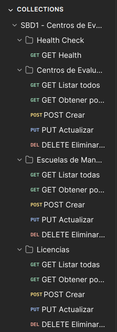 |
| Estructura de carpetas | 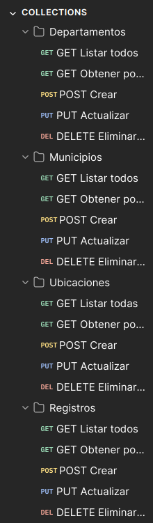 |
| Variables de entorno | 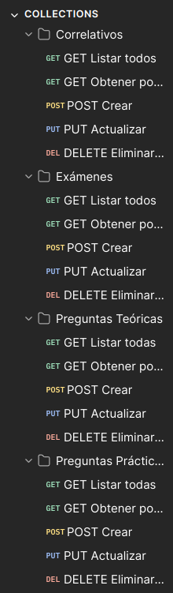 |
| Configuración de colección | 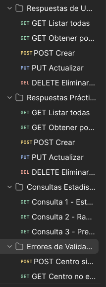 |

#### Health Check

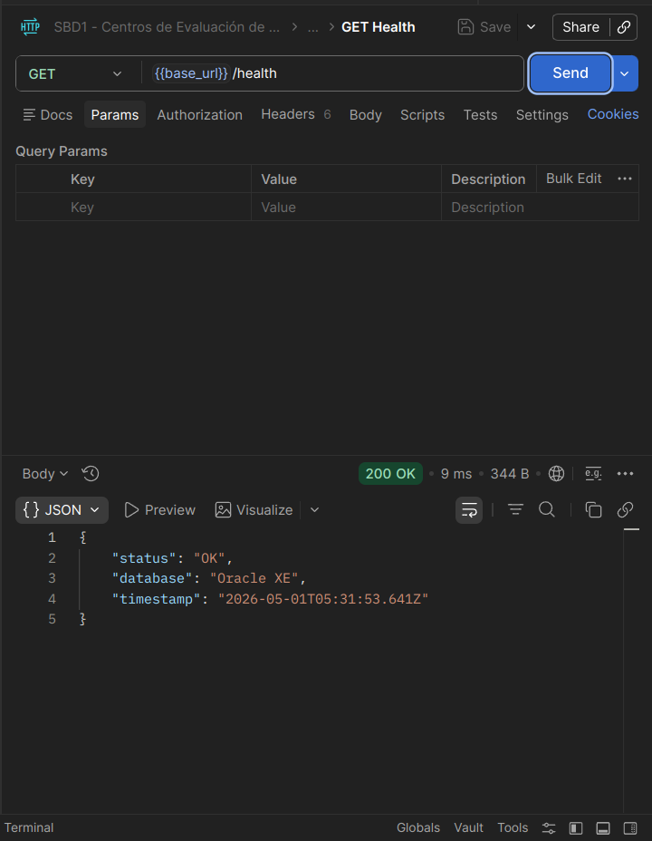

#### Peticiones CRUD

| Petición | Captura |
|---|---|
| Listar centros | 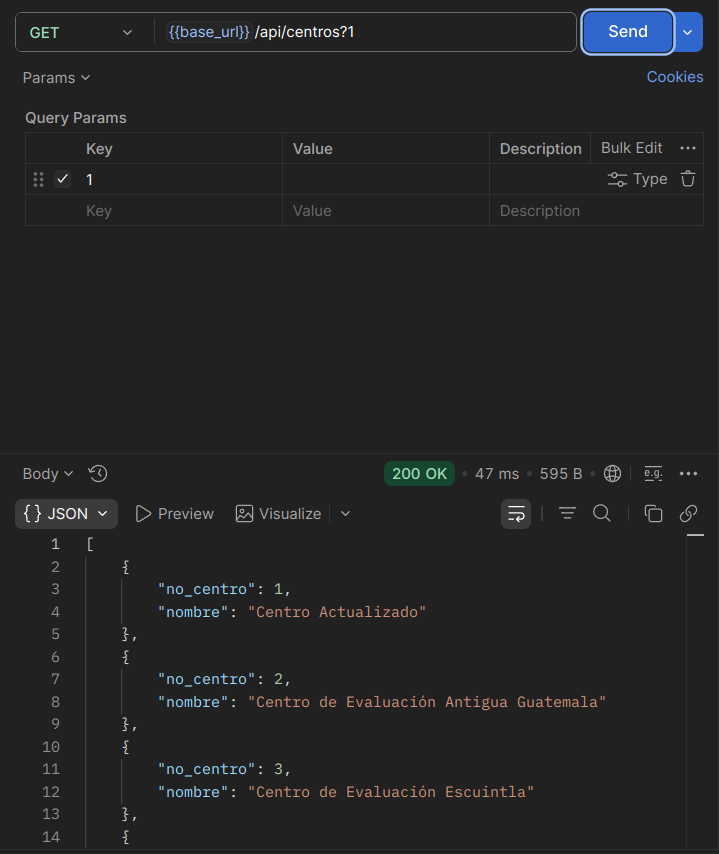 |
| Listar escuelas | 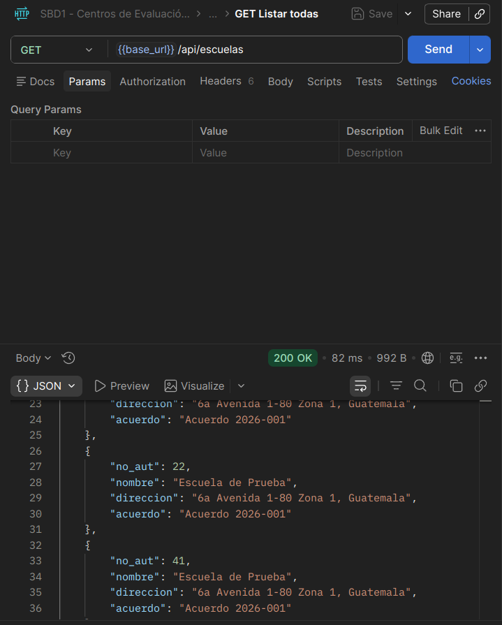 |
| Listar licencias | 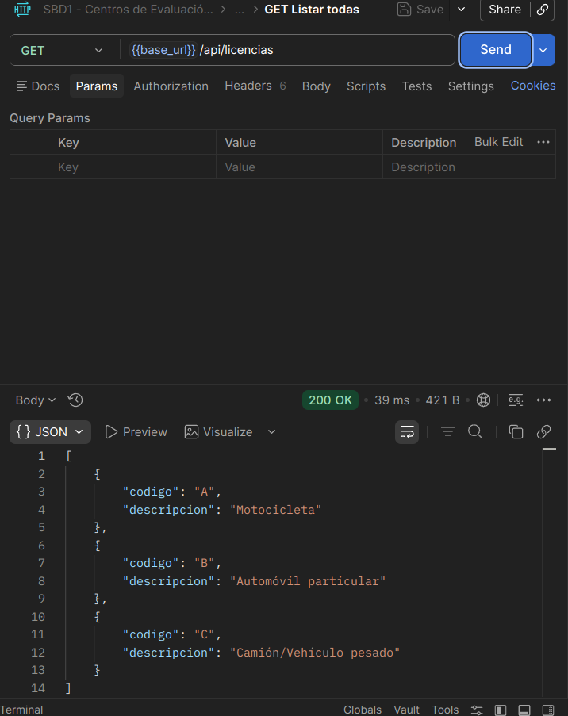 |
| Listar departamentos | 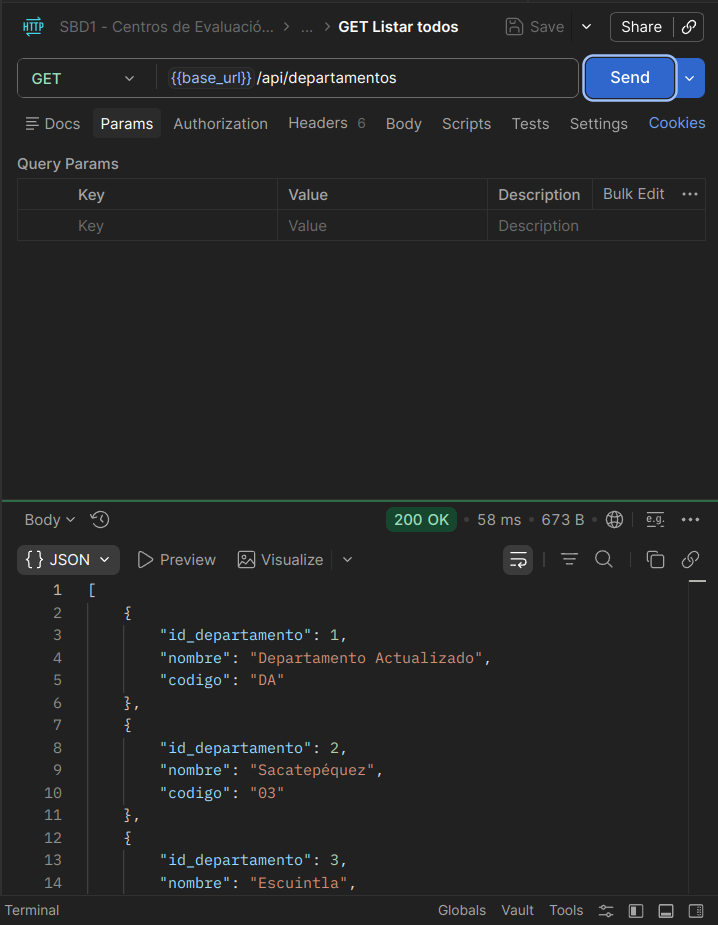 |
| Crear municipio | 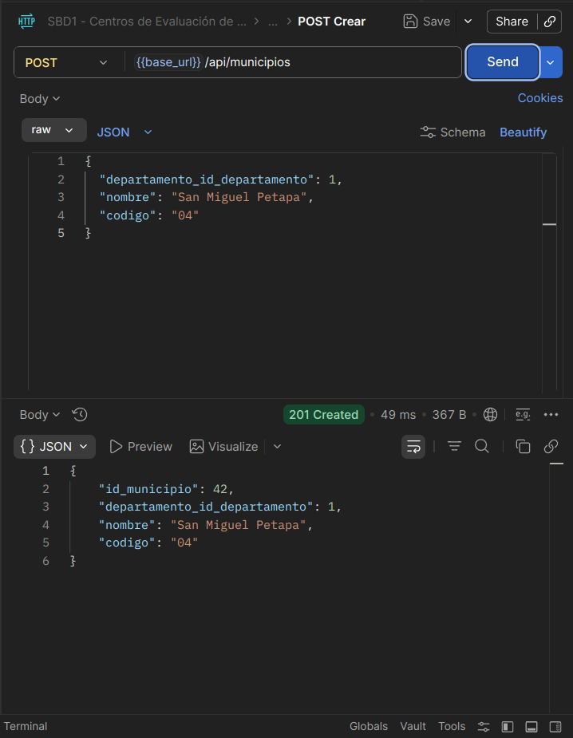 |
| Crear ubicación | 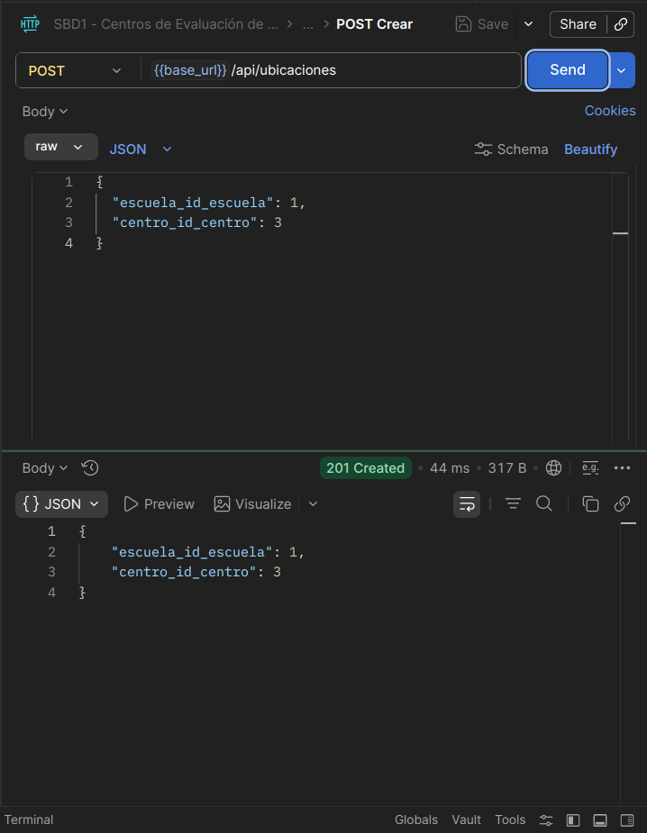 |
| Crear registro | 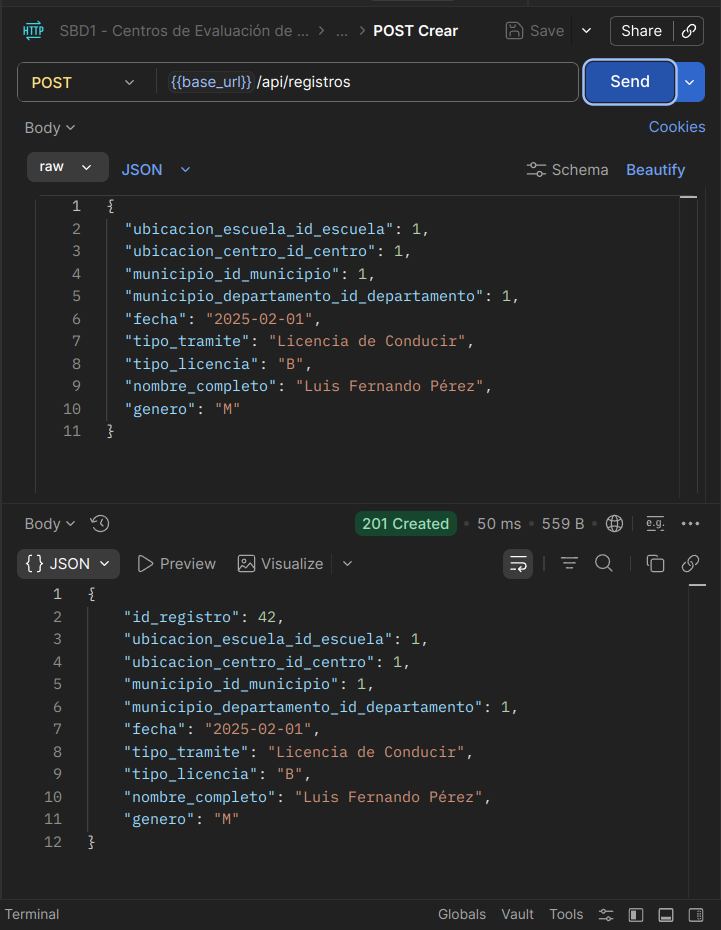 |

## Detener los servicios


```bash
docker-compose down
```

Para eliminar también el volumen de datos:

```bash
docker-compose down -v
```

## Capturas de Pantalla

### Conexión a Oracle XE desde DBeaver


### Datos de las Tablas

| Tabla | Captura |
|---|---|
| CENTRO_EVAL | 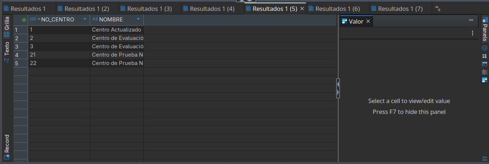 |
| ESCUELA_AUTOMOV | 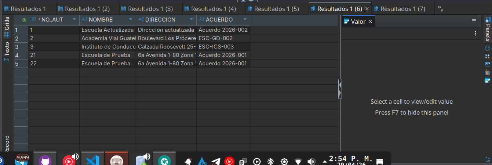 |
| LICENCIA | 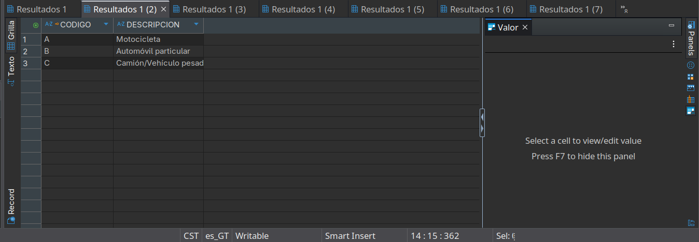 |
| DEPARTAMENTO | 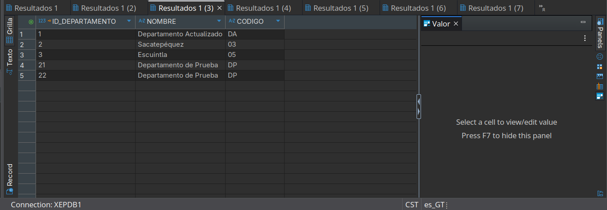 |
| MUNICIPIO | 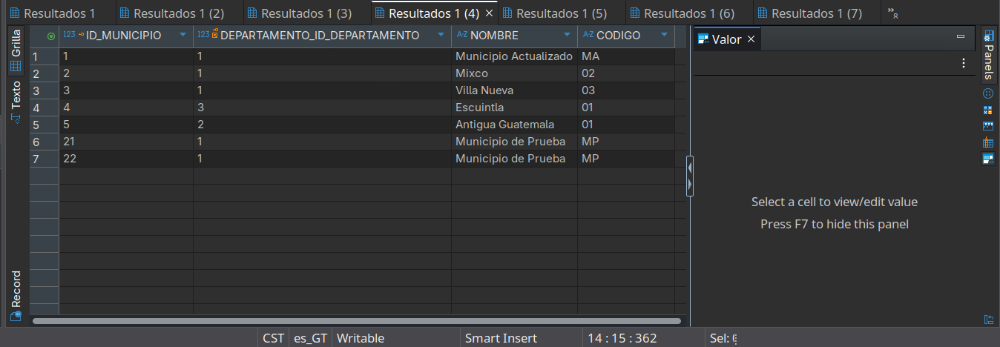 |
| UBICACION | 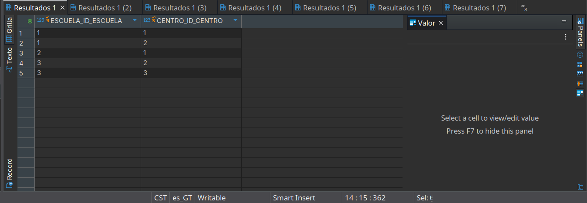 |
| REGISTRO | 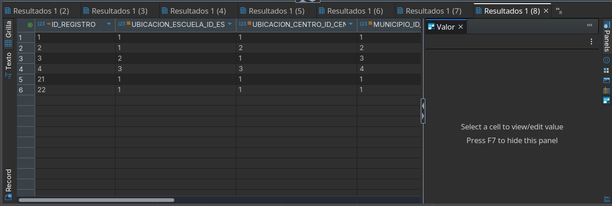 |
| CORRELATIVO | 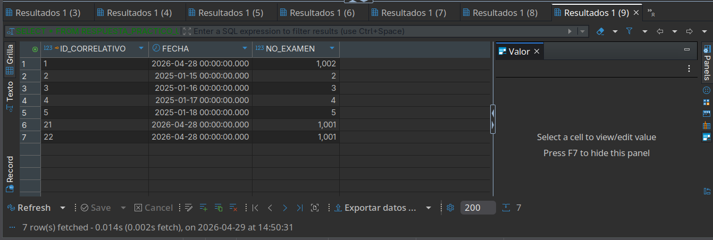 |
| EXAMEN | 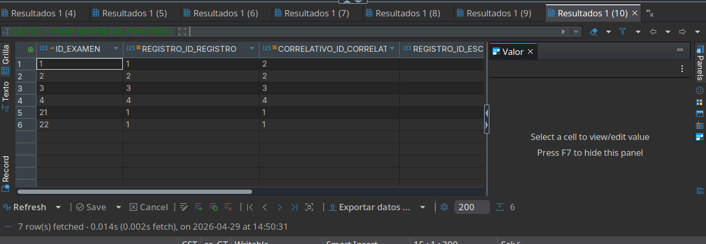 |
| PREGUNTA | 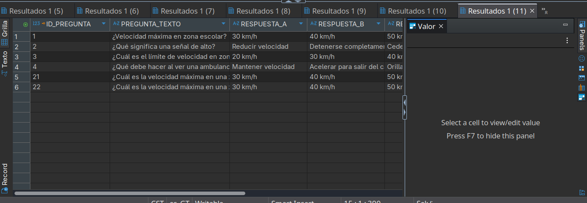 |
| PREGUNTA_PRACTICO | 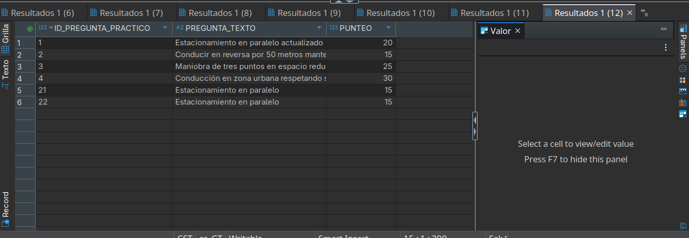 |
| RESPUESTA_USUARIO | 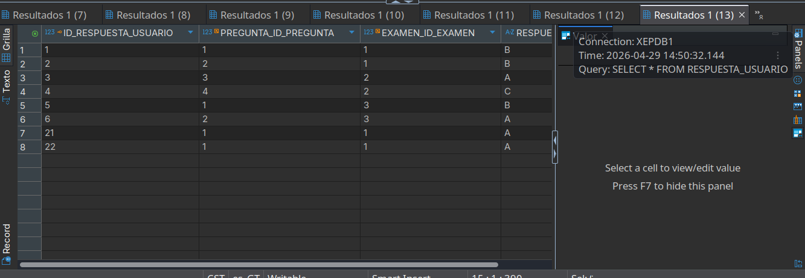 |
| RESPUESTA_PRACTICO_USUARIO | 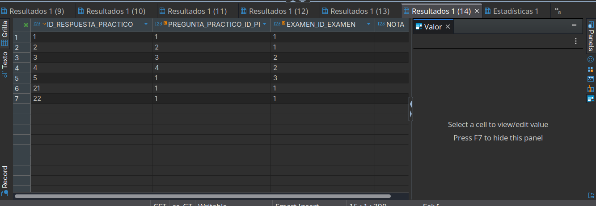 |

---

**Carnet:** 202300625
